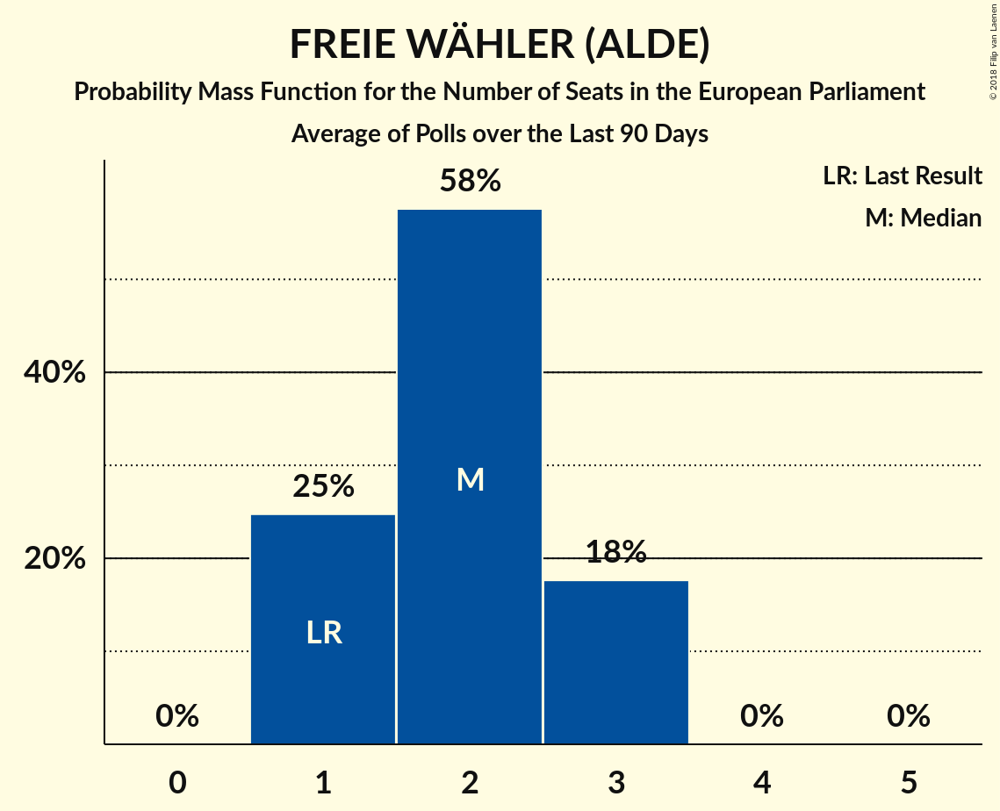

# FREIE WÄHLER (ALDE)

<a href="#voting-intentions">Voting Intentions</a> | <a href="#seats">Seats</a>

## Voting Intentions

Last result: **1.5%** (General Election of 25 May 2014)

### Confidence Intervals

| Period     | Polling firm/Commissioner(s) | Median | 80% Confidence Interval | 90% Confidence Interval | 95% Confidence Interval | 99% Confidence Interval |
|:----------:|:----------------:|:-----------:|:-----------------------:|:-----------------------:|:-----------------------:|:-----------------------:|
| N/A | [Poll Average](average.html) | 1.8% | 1.2–2.4% | 1.1–2.6% | 1.0–2.8% | 0.8–3.2% |
| [10–12 April 2018](2018-04-12-ForschungsgruppeWahlen.html) | Forschungsgruppe Wahlen   ZDF | NaN% | 1.2–2.2% | 1.1–2.4% | 1.1–2.6% | 0.9–2.9% |
| [5–11 April 2018](2018-04-11-Emnid.html) | Emnid   Bild am Sonntag | 1.7% | 1.2–2.2% | 1.2–2.3% | 1.1–2.5% | 1.0–2.7% |
| [6–9 April 2018](2018-04-09-INSAandYouGov.html) | INSA and YouGov   Bild | 1.2% | 1.0–1.6% | 0.9–1.7% | 0.8–1.8% | 0.7–2.0% |
| [3–6 April 2018](2018-04-06-Forsa.html) | Forsa   Stern and RTL | 2.1% | 1.7–2.6% | 1.6–2.8% | 1.5–2.9% | 1.3–3.2% |
| [29 March–5 April 2018](2018-04-05-Emnid.html) | Emnid   Bild am Sonntag | 2.1% | 1.6–2.6% | 1.5–2.8% | 1.4–2.9% | 1.2–3.2% |
| [23 March–4 April 2018](2018-04-04-pollytix.html) | pollytix | 2.1% | 1.7–2.7% | 1.6–2.9% | 1.5–3.0% | 1.3–3.3% |
| [3–4 April 2018](2018-04-04-Infratestdimap.html) | Infratest dimap   ARD | 1.7% | 1.3–2.2% | 1.2–2.3% | 1.1–2.5% | 1.0–2.7% |
| [29–31 March 2018](2018-03-31-INSAandYouGov.html) | INSA and YouGov   Bild | 1.2% | 0.9–1.8% | 0.8–1.9% | 0.7–2.1% | 0.6–2.4% |
| [26–29 March 2018](2018-03-29-Forsa.html) | Forsa   Stern and RTL | 2.1% | 1.7–2.6% | 1.6–2.8% | 1.5–2.9% | 1.3–3.2% |
| [22–28 March 2018](2018-03-28-Emnid.html) | Emnid   Bild am Sonntag | 2.1% | 1.7–2.5% | 1.6–2.7% | 1.5–2.8% | 1.4–3.0% |
| [23–27 March 2018](2018-03-27-YouGov.html) | YouGov   RedaktionsNetzwerk Deutschland | 1.6% | 1.3–2.1% | 1.2–2.3% | 1.1–2.4% | 1.0–2.7% |
| [23–26 March 2018](2018-03-26-INSAandYouGov.html) | INSA and YouGov   Bild | 1.2% | 1.0–1.6% | 0.9–1.7% | 0.8–1.8% | 0.7–2.0% |
| [19–23 March 2018](2018-03-23-Forsa.html) | Forsa   Stern and RTL | 1.7% | 1.3–2.1% | 1.2–2.2% | 1.1–2.4% | 1.0–2.6% |
| [20–21 March 2018](2018-03-21-Infratestdimap.html) | Infratest dimap   ARD | 1.6% | 1.2–2.3% | 1.1–2.5% | 1.0–2.6% | 0.9–3.0% |
| [16–21 March 2018](2018-03-21-GMS.html) | GMS | 2.1% | 1.6–2.8% | 1.5–3.0% | 1.4–3.2% | 1.2–3.6% |
| [15–21 March 2018](2018-03-21-Emnid.html) | Emnid   Bild am Sonntag | 1.7% | 1.4–2.1% | 1.3–2.2% | 1.2–2.3% | 1.1–2.6% |
| [16–19 March 2018](2018-03-19-INSAandYouGov.html) | INSA and YouGov   Bild | 1.3% | 1.0–1.6% | 0.9–1.8% | 0.9–1.8% | 0.7–2.0% |
| [12–16 March 2018](2018-03-16-Forsa.html) | Forsa   Stern and RTL | 2.1% | 1.7–2.6% | 1.6–2.7% | 1.5–2.8% | 1.4–3.1% |
| [13–15 March 2018](2018-03-15-ForschungsgruppeWahlen.html) | Forschungsgruppe Wahlen   ZDF | 1.6% | 1.3–2.2% | 1.2–2.4% | 1.1–2.5% | 0.9–2.9% |
| [2–15 March 2018](2018-03-15-Allensbach.html) | Allensbach   Frankfurter Allgemeine Zeitung | 1.4% | 1.1–2.0% | 1.0–2.1% | 0.9–2.3% | 0.8–2.5% |
| [8–14 March 2018](2018-03-14-Emnid.html) | Emnid   Bild am Sonntag | 1.6% | 1.3–2.1% | 1.2–2.2% | 1.2–2.3% | 1.0–2.5% |
| [9–12 March 2018](2018-03-12-INSAandYouGov.html) | INSA and YouGov   Bild | 1.2% | 1.0–1.6% | 0.9–1.7% | 0.8–1.8% | 0.7–2.0% |
| [5–9 March 2018](2018-03-09-Forsa.html) | Forsa   Stern and RTL | 1.7% | 1.4–2.1% | 1.3–2.3% | 1.2–2.4% | 1.1–2.6% |
| [1–7 March 2018](2018-03-07-Emnid.html) | Emnid   Bild am Sonntag | 2.1% | 1.7–2.6% | 1.6–2.7% | 1.5–2.9% | 1.4–3.1% |
| [5 March 2018](2018-03-05-INSAandYouGov.html) | INSA and YouGov   Bild | 1.2% | 0.9–1.8% | 0.8–2.0% | 0.7–2.1% | 0.6–2.4% |
| [4–5 March 2018](2018-03-05-Forsa.html) | Forsa   Stern and RTL | 1.6% | 1.2–2.2% | 1.1–2.4% | 1.0–2.6% | 0.9–2.9% |
| [26 February–2 March 2018](2018-03-02-Forsa.html) | Forsa   Stern and RTL | 1.6% | 1.3–2.1% | 1.2–2.2% | 1.2–2.3% | 1.0–2.6% |
| [26–28 February 2018](2018-02-28-YouGov.html) | YouGov   RedaktionsNetzwerk Deutschland | 1.6% | N/A | N/A | N/A | N/A |
| [26–28 February 2018](2018-02-28-Infratestdimap.html) | Infratest dimap   ARD | 1.7% | N/A | N/A | N/A | N/A |
| [22–28 February 2018](2018-02-28-Emnid.html) | Emnid   Bild am Sonntag | 1.6% | N/A | N/A | N/A | N/A |
| [23–26 February 2018](2018-02-26-INSAandYouGov.html) | INSA and YouGov   Bild | 1.2% | N/A | N/A | N/A | N/A |
| [19–23 February 2018](2018-02-23-Forsa.html) | Forsa   Stern and RTL | 1.6% | N/A | N/A | N/A | N/A |
| [20–22 February 2018](2018-02-22-ForschungsgruppeWahlen.html) | Forschungsgruppe Wahlen   ZDF | 2.1% | N/A | N/A | N/A | N/A |
| [20–21 February 2018](2018-02-21-Infratestdimap.html) | Infratest dimap   ARD | 1.6% | N/A | N/A | N/A | N/A |
| [15–21 February 2018](2018-02-21-Emnid.html) | Emnid   Bild am Sonntag | 1.3% | N/A | N/A | N/A | N/A |
| [16–19 February 2018](2018-02-19-INSAandYouGov.html) | INSA and YouGov   Bild | 1.5% | N/A | N/A | N/A | N/A |
| [12–16 February 2018](2018-02-16-Forsa.html) | Forsa   Stern and RTL | 2.1% | N/A | N/A | N/A | N/A |
| [13–15 February 2018](2018-02-15-Infratestdimap.html) | Infratest dimap   ARD | 1.2% | N/A | N/A | N/A | N/A |
| [2–15 February 2018](2018-02-15-Allensbach.html) | Allensbach   Frankfurter Allgemeine Zeitung | 2.0% | N/A | N/A | N/A | N/A |
| [8–14 February 2018](2018-02-14-Emnid.html) | Emnid   Bild am Sonntag | 1.6% | N/A | N/A | N/A | N/A |
| [9–12 February 2018](2018-02-12-INSAandYouGov.html) | INSA and YouGov   Bild | 1.6% | N/A | N/A | N/A | N/A |
| [7–8 February 2018](2018-02-08-Forsa.html) | Forsa   Stern and RTL | 2.1% | N/A | N/A | N/A | N/A |
| [1–7 February 2018](2018-02-07-GMS.html) | GMS | 2.1% | N/A | N/A | N/A | N/A |
| [1–7 February 2018](2018-02-07-Emnid.html) | Emnid   Bild am Sonntag | 2.0% | N/A | N/A | N/A | N/A |
| [2–5 February 2018](2018-02-05-INSAandYouGov.html) | INSA and YouGov   Bild | 1.7% | N/A | N/A | N/A | N/A |
| [29 January–2 February 2018](2018-02-02-Forsa.html) | Forsa   Stern and RTL | 2.0% | N/A | N/A | N/A | N/A |
| [30 January–1 February 2018](2018-02-01-ForschungsgruppeWahlen.html) | Forschungsgruppe Wahlen   ZDF | 1.7% | N/A | N/A | N/A | N/A |
| [29–31 January 2018](2018-01-31-Infratestdimap.html) | Infratest dimap   ARD | 1.3% | N/A | N/A | N/A | N/A |
| [25–31 January 2018](2018-01-31-Emnid.html) | Emnid   Bild am Sonntag | 1.7% | N/A | N/A | N/A | N/A |
| [26–29 January 2018](2018-01-29-INSAandYouGov.html) | INSA and YouGov   Bild | 1.3% | N/A | N/A | N/A | N/A |

### Probability Mass Function

The following table shows the probability mass function per percentage block of voting intentions for the [poll average](average.html) for FREIE WÄHLER (ALDE).

| Voting Intentions | Probability | Accumulated | Special Marks |
|:-----------------:|:-----------:|:-----------:|:-------------:|
| 0.0–0.5% | 0% | 100% |  |
| 0.5–1.5% | 32% | 100% | Last Result |
| 1.5–2.5% | 62% | 68% | Median |
| 2.5–3.5% | 6% | 6% |  |
| 3.5–4.5% | 0.1% | 0.1% |  |
| 4.5–5.5% | 0% | 0% |  |

## Seats

Last result: **1** seats (General Election of 25 May 2014)

### Confidence Intervals

| Period     | Polling firm/Commissioner(s) | Median | 80% Confidence Interval | 90% Confidence Interval | 95% Confidence Interval | 99% Confidence Interval |
|:----------:|:----------------:|:------:|:-----------------------:|:-----------------------:|:-----------------------:|:-----------------------:|
| N/A | [Poll Average](average.html) | 2 | 1–2 | 1–3 | 1–3 | 1–3 |
| [10–12 April 2018](2018-04-12-ForschungsgruppeWahlen.html) | Forschungsgruppe Wahlen   ZDF | 1 | 1–2 | 1–2 | 1–2 | 1–3 |
| [5–11 April 2018](2018-04-11-Emnid.html) | Emnid   Bild am Sonntag | 2 | 1–2 | 1–2 | 1–2 | 1–2 |
| [6–9 April 2018](2018-04-09-INSAandYouGov.html) | INSA and YouGov   Bild | 1 | 1–2 | 1–2 | 1–2 | 1–2 |
| [3–6 April 2018](2018-04-06-Forsa.html) | Forsa   Stern and RTL | 2 | 2 | 2 | 2 | 2 |
| [29 March–5 April 2018](2018-04-05-Emnid.html) | Emnid   Bild am Sonntag | 1 | 1–2 | 1–2 | 1–2 | 1–3 |
| [23 March–4 April 2018](2018-04-04-pollytix.html) | pollytix | 3 | 1–3 | 1–3 | 1–3 | 1–3 |
| [3–4 April 2018](2018-04-04-Infratestdimap.html) | Infratest dimap   ARD | 1 | 1–2 | 1–2 | 1–2 | 1–2 |
| [29–31 March 2018](2018-03-31-INSAandYouGov.html) | INSA and YouGov   Bild | 2 | 1–3 | 1–3 | 1–3 | 1–3 |
| [26–29 March 2018](2018-03-29-Forsa.html) | Forsa   Stern and RTL | 2 | 2 | 2 | 2 | 2–3 |
| [22–28 March 2018](2018-03-28-Emnid.html) | Emnid   Bild am Sonntag | 2 | 2 | 2 | 2 | 2 |
| [23–27 March 2018](2018-03-27-YouGov.html) | YouGov   RedaktionsNetzwerk Deutschland | 2 | 1–2 | 1–2 | 1–2 | 1–3 |
| [23–26 March 2018](2018-03-26-INSAandYouGov.html) | INSA and YouGov   Bild | 2 | 1–2 | 1–2 | 1–2 | 1–2 |
| [19–23 March 2018](2018-03-23-Forsa.html) | Forsa   Stern and RTL | 1 | 1–2 | 1–2 | 1–2 | 1–2 |
| [20–21 March 2018](2018-03-21-Infratestdimap.html) | Infratest dimap   ARD | 2 | 1–2 | 1–2 | 1–3 | 1–3 |
| [16–21 March 2018](2018-03-21-GMS.html) | GMS | 2 | 2–3 | 2–3 | 1–3 | 1–3 |
| [15–21 March 2018](2018-03-21-Emnid.html) | Emnid   Bild am Sonntag | 1 | 1–2 | 1–2 | 1–2 | 1–2 |
| [16–19 March 2018](2018-03-19-INSAandYouGov.html) | INSA and YouGov   Bild | 1 | 1 | 1–2 | 1–2 | 1–2 |
| [12–16 March 2018](2018-03-16-Forsa.html) | Forsa   Stern and RTL | 2 | 1–2 | 1–2 | 1–3 | 1–3 |
| [13–15 March 2018](2018-03-15-ForschungsgruppeWahlen.html) | Forschungsgruppe Wahlen   ZDF | 1 | 1–2 | 1–2 | 1–2 | 1–2 |
| [2–15 March 2018](2018-03-15-Allensbach.html) | Allensbach   Frankfurter Allgemeine Zeitung | 1 | 1–2 | 1–2 | 1–2 | 1–2 |
| [8–14 March 2018](2018-03-14-Emnid.html) | Emnid   Bild am Sonntag | 2 | 2 | 1–2 | 1–2 | 1–2 |
| [9–12 March 2018](2018-03-12-INSAandYouGov.html) | INSA and YouGov   Bild | 1 | 1 | 1–2 | 1–2 | 1–2 |
| [5–9 March 2018](2018-03-09-Forsa.html) | Forsa   Stern and RTL | 1 | 1–2 | 1–2 | 1–2 | 1–2 |
| [1–7 March 2018](2018-03-07-Emnid.html) | Emnid   Bild am Sonntag | 2 | 2 | 1–3 | 1–3 | 1–3 |
| [5 March 2018](2018-03-05-INSAandYouGov.html) | INSA and YouGov   Bild | 1 | 1–2 | 1–2 | 1–2 | 1–2 |
| [4–5 March 2018](2018-03-05-Forsa.html) | Forsa   Stern and RTL | 2 | 1–2 | 1–2 | 1–2 | 1–3 |
| [26 February–2 March 2018](2018-03-02-Forsa.html) | Forsa   Stern and RTL | 2 | 1–2 | 1–2 | 1–2 | 1–3 |
| [26–28 February 2018](2018-02-28-YouGov.html) | YouGov   RedaktionsNetzwerk Deutschland |  |  |  |  |  |
| [26–28 February 2018](2018-02-28-Infratestdimap.html) | Infratest dimap   ARD |  |  |  |  |  |
| [22–28 February 2018](2018-02-28-Emnid.html) | Emnid   Bild am Sonntag |  |  |  |  |  |
| [23–26 February 2018](2018-02-26-INSAandYouGov.html) | INSA and YouGov   Bild |  |  |  |  |  |
| [19–23 February 2018](2018-02-23-Forsa.html) | Forsa   Stern and RTL |  |  |  |  |  |
| [20–22 February 2018](2018-02-22-ForschungsgruppeWahlen.html) | Forschungsgruppe Wahlen   ZDF |  |  |  |  |  |
| [20–21 February 2018](2018-02-21-Infratestdimap.html) | Infratest dimap   ARD |  |  |  |  |  |
| [15–21 February 2018](2018-02-21-Emnid.html) | Emnid   Bild am Sonntag |  |  |  |  |  |
| [16–19 February 2018](2018-02-19-INSAandYouGov.html) | INSA and YouGov   Bild |  |  |  |  |  |
| [12–16 February 2018](2018-02-16-Forsa.html) | Forsa   Stern and RTL |  |  |  |  |  |
| [13–15 February 2018](2018-02-15-Infratestdimap.html) | Infratest dimap   ARD |  |  |  |  |  |
| [2–15 February 2018](2018-02-15-Allensbach.html) | Allensbach   Frankfurter Allgemeine Zeitung |  |  |  |  |  |
| [8–14 February 2018](2018-02-14-Emnid.html) | Emnid   Bild am Sonntag |  |  |  |  |  |
| [9–12 February 2018](2018-02-12-INSAandYouGov.html) | INSA and YouGov   Bild |  |  |  |  |  |
| [7–8 February 2018](2018-02-08-Forsa.html) | Forsa   Stern and RTL |  |  |  |  |  |
| [1–7 February 2018](2018-02-07-GMS.html) | GMS |  |  |  |  |  |
| [1–7 February 2018](2018-02-07-Emnid.html) | Emnid   Bild am Sonntag |  |  |  |  |  |
| [2–5 February 2018](2018-02-05-INSAandYouGov.html) | INSA and YouGov   Bild |  |  |  |  |  |
| [29 January–2 February 2018](2018-02-02-Forsa.html) | Forsa   Stern and RTL |  |  |  |  |  |
| [30 January–1 February 2018](2018-02-01-ForschungsgruppeWahlen.html) | Forschungsgruppe Wahlen   ZDF |  |  |  |  |  |
| [29–31 January 2018](2018-01-31-Infratestdimap.html) | Infratest dimap   ARD |  |  |  |  |  |
| [25–31 January 2018](2018-01-31-Emnid.html) | Emnid   Bild am Sonntag |  |  |  |  |  |
| [26–29 January 2018](2018-01-29-INSAandYouGov.html) | INSA and YouGov   Bild |  |  |  |  |  |

### Probability Mass Function

The following table shows the probability mass function per seat for the [poll average](average.html) for FREIE WÄHLER (ALDE).

| Number of Seats | Probability | Accumulated | Special Marks |
|:---------------:|:-----------:|:-----------:|:-------------:|
| 1 | 39% | 100% | Last Result |
| 2 | 54% | 61% | Median |
| 3 | 7% | 7% |  |
| 4 | 0% | 0% |  |

